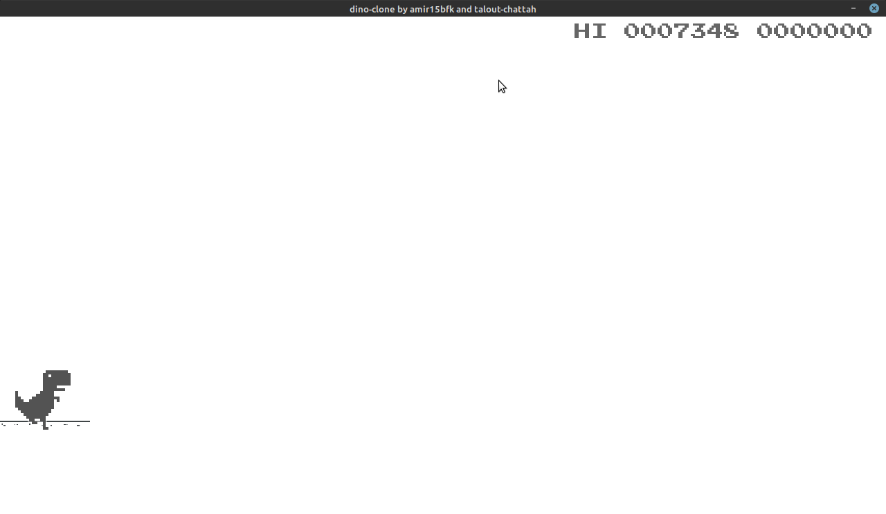
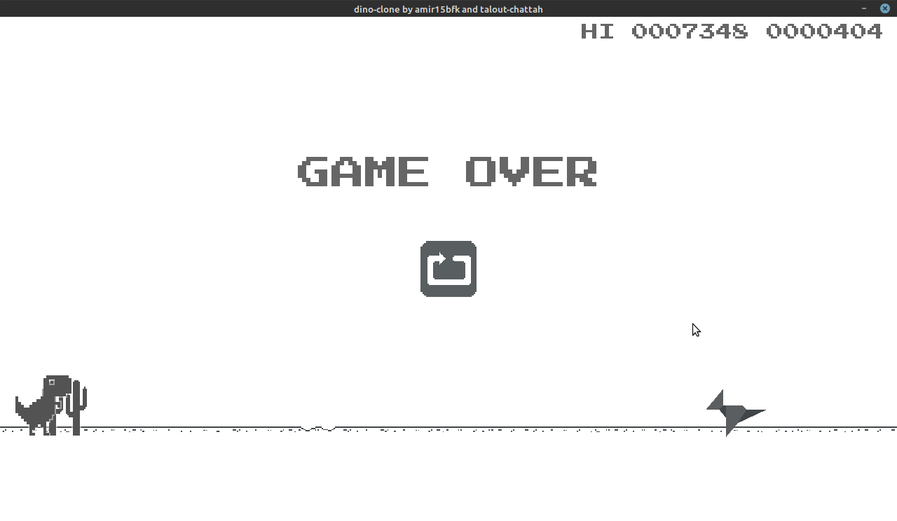
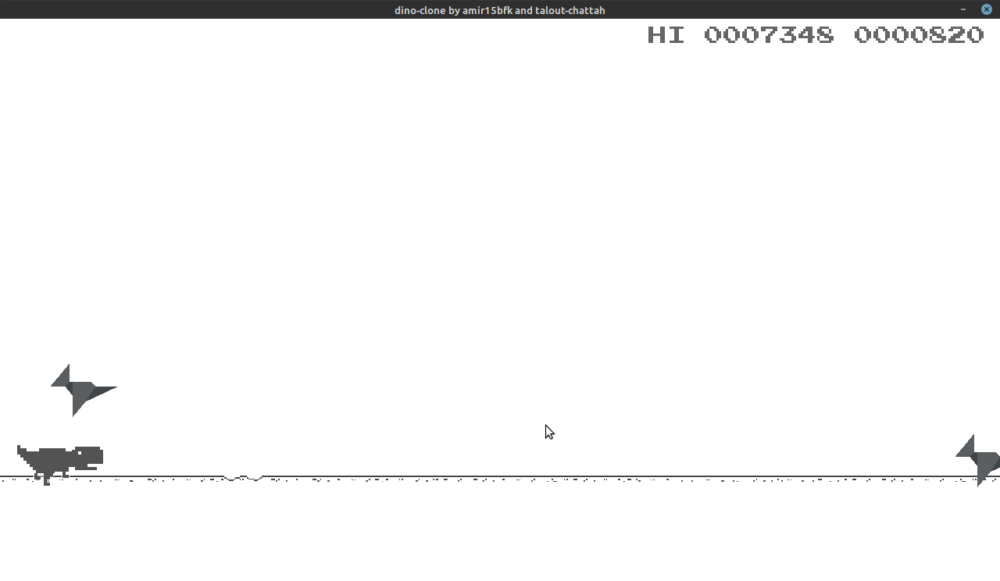
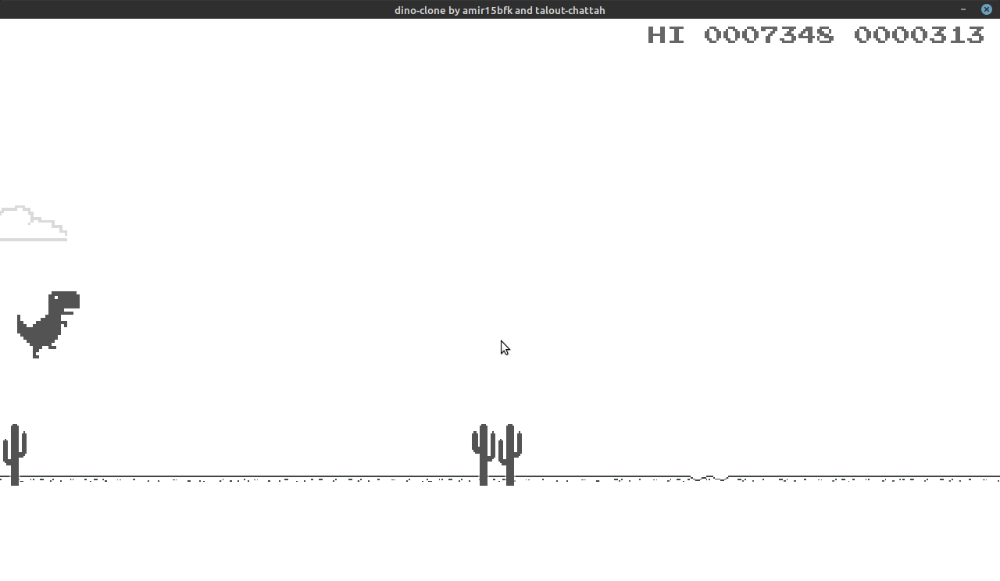

# dino-clone Using python Pygame
as a participation in ITC challenge 

# i use assets from 
[codewmax](https://github.com/codewmax/ChromeDinosaur)
[nabhoneel](https://github.com/nabhoneel/chrome-dino-game)
[ifariat](https://github.com/ifariat/DINO-CLONE/)

